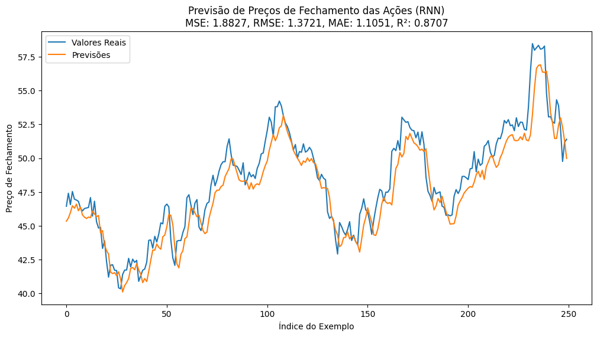
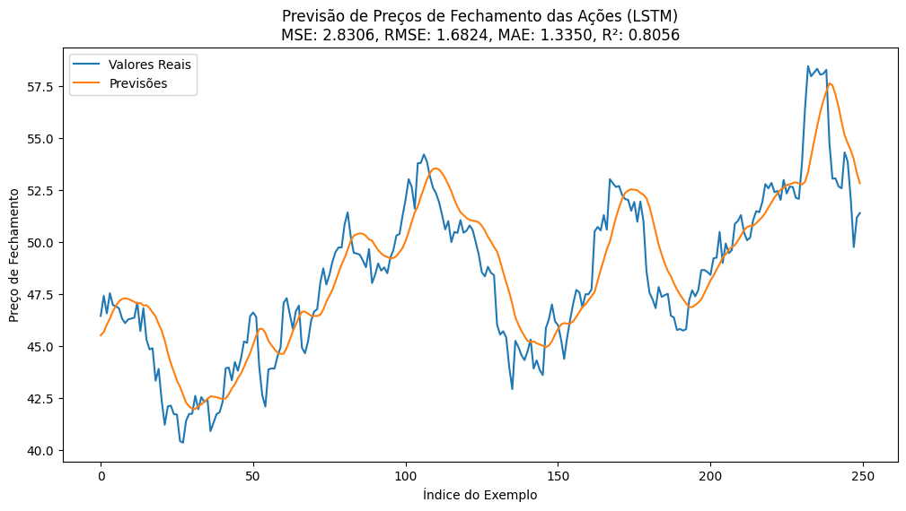
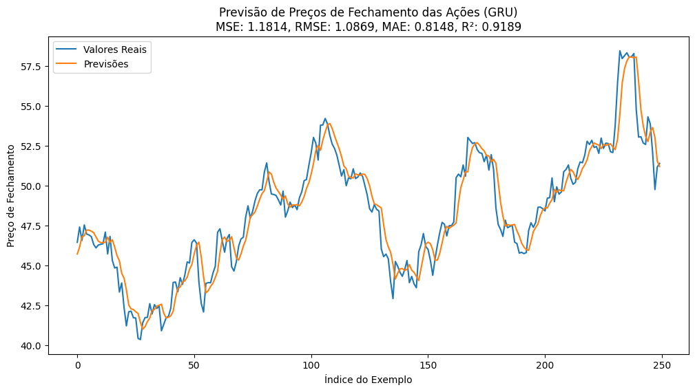

# RESUMO
Link para o vídeo: https://drive.google.com/file/d/1ZLdwKwHPJBEgWmwNW1GJ-zPeOpjI1CIy/view?usp=drive_link

O trabalho em questão objetivou a análise do fechamento de preço de ações utilizando 3 métodos diferentes, sendo RNN, LSTM e GRU. Primeiramente, o dataframe gerado usou um recurso para filtrar os dados por ação, visando a redução de linhas e, consequentemente, aumentando a velocidade de realização do trabalho, uma vez que o custo computacional seria menor. Partindo para o desenvolvimento do código, os preços de fechamento são extraídos dos dados fornecidos e normalizados entre 0 e 1. A partir disso, são criadas sequências de entrada e saída para o método escolhido analisar com base em uma janela temporal definida. Os dados são divididos em conjuntos de treinamento e teste, e um modelo é construído utilizando uma camada simples seguida por uma camada densa. O modelo é compilado com o otimizador Adam e a função de perda de erro médio quadrático. Após o treinamento do modelo, são realizadas avaliações de desempenho utilizando métricas como erro quadrático médio (MSE), raiz do erro quadrático médio (RMSE), erro absoluto médio (MAE) e coeficiente de determinação (R²). As previsões são desnormalizadas e comparadas com os valores reais. Por fim, os resultados são visualizados em um gráfico que mostra os valores reais em comparação com as previsões, com as métricas de avaliação incluídas no título do gráfico.

# RNN  - Gráfico

Os resultados do modelo RNN apresentam um MSE de 1.8827, indicando que, em média, os quadrados dos erros de previsão são relativamente pequenos, e um RMSE de 1.3721, sugerindo que as previsões estão desviando aproximadamente 1.37 unidades dos valores reais. O MAE de 1.1051 revela uma tendência do modelo a fazer previsões mais conservadoras, minimizando os erros absolutos. Com um R² de 0.8707, o modelo é capaz de explicar cerca de 87.07% da variabilidade nos dados de fechamento das ações, evidenciando sua capacidade de capturar a tendência geral dos dados. Os resultados mostram uma precisão razoável nas previsões, estando em um patamar acima do LSTM, mas ainda com significativa diferença para o GRU.

# LSTM - Gráfico

Os resultados do modelo LSTM revelam uma precisão ligeiramente inferior em comparação com o modelo RNN, com um MSE de 2.8306 indicando uma tendência a cometer erros mais significativos e um RMSE de 1.6824 mostrando uma média de desvio de aproximadamente 1.68 unidades dos valores reais de fechamento das ações. O MAE de 1.3350 reflete uma propensão do modelo a fazer previsões com um desvio absoluto médio de cerca de 1.34 unidades dos valores reais, enquanto o R² de 0.8056 indica sua capacidade de explicar aproximadamente 80.56% da variabilidade nos dados. Embora ainda seja capaz de explicar uma parcela significativa da variabilidade, o modelo peca em pontos importantes e necessita de melhorias, especialmente na redução do erro quadrático médio e na precisão das previsões, destacando a necessidade de avanços do modelo LSTM para alcançar resultados comparáveis ao modelo RNN.

# GRU - Gráfico

Os resultados do modelo GRU revelam uma precisão notavelmente superior em comparação com os modelos RNN e LSTM. Com um MSE de 1.1814, um RMSE de 1.0869 e um MAE de 0.8148, o GRU demonstra menores erros médios e desvios em suas previsões, indicando uma capacidade superior de prever com precisão os valores de fechamento das ações. Além disso, o coeficiente de determinação (R²) de 0.9189 destaca sua capacidade de explicar aproximadamente 91.89% da variabilidade nos dados. Esses resultados sugerem que o modelo GRU é altamente eficaz na captura da tendência geral dos dados e mais adequada para a realização da tarefa, se levado em conta os dados utilizados e ferramentas comparadas ao longo do trabalho.

